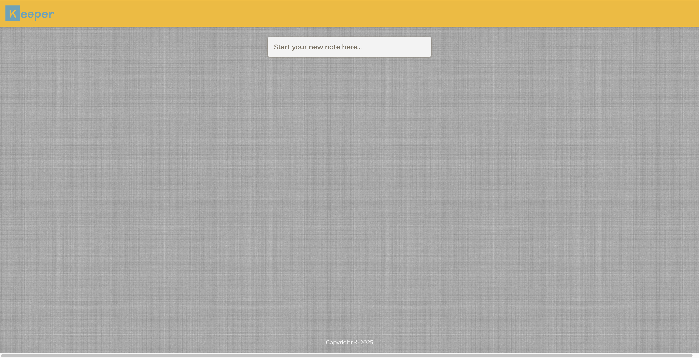
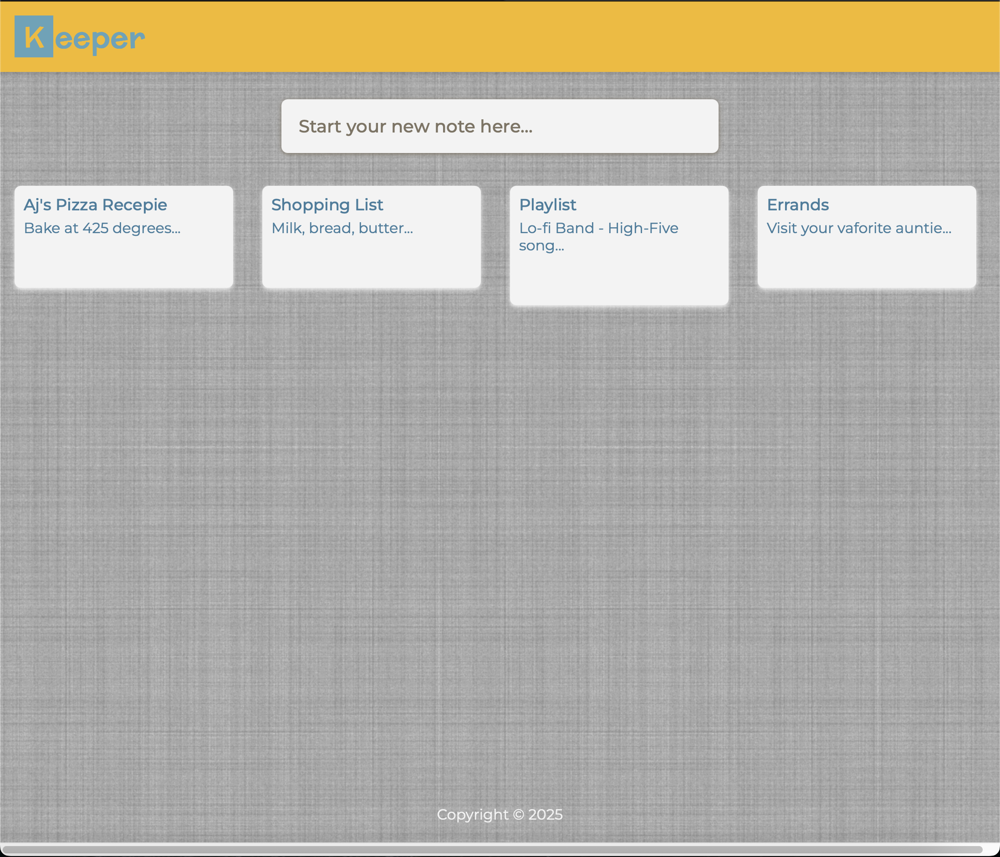
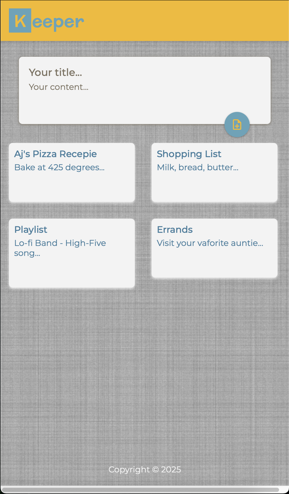

# 🗒️ Keeper – React Notes Manager

A simple, fast, and responsive **notes manager built with React** and styled using **Material UI**. Create, edit, and delete notes in a clean, modern interface.

> ⚠️ Notes are **not saved** between sessions. All data is stored in memory and will reset on page refresh or browser close.

---

## 🚀 Live Demo

👉 [Open the app](https://borisplotnikov.github.io/keeper/)

---

## ✨ Features

- 🧠 Built with **React** and modern **React Hooks** (`useState`, `useEffect`, `useRef`, `useCallback`)
- 🆔 Unique IDs for notes using **UUID**
- ✅ Prop type validation via **PropTypes**
- 🎨 Stylish UI with **Material UI (MUI)**
- 📱 Responsive layout
- ⚡ Fast, lightweight, and fully client-side

---

## 📸 Preview

```markdown



