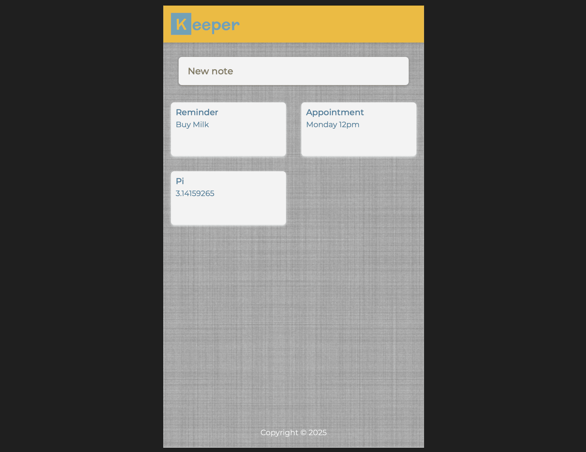

# 🗒️ Keeper – React Notes Manager

[](https://reactjs.org/)
[](https://mui.com/)
[](LICENSE)
[](https://borisplotnikov.github.io/keeper/)

---

A simple, fast, and responsive **notes manager built with React** and styled using **Material UI**. Create and delete notes in a clean, modern interface.

> ⚠️ Notes are **not saved** between sessions. All data is stored in memory and will reset on page refresh or browser close.

---

## 🚀 Live Demo

👉 [Open the app](https://borisplotnikov.github.io/keeper/)

---

## ✨ Features

- 🧠 Built with **React** and modern **React Hooks** (`useState`, `useEffect`, `useRef`, `useCallback`)
- 🆔 Unique IDs for notes using **UUID**
- ✅ Prop type validation via **PropTypes**
- 🎨 Stylish UI with **Material UI (MUI)**
- 📱 Responsive layout
- ⚡ Fast, lightweight, and fully client-side

---

## 🛠 Tech Stack

| Technology   | Description                          |
| ------------ | ------------------------------------ |
| React        | Frontend framework                   |
| React Hooks  | Functional component logic           |
| UUID         | Generates unique IDs for notes       |
| PropTypes    | Runtime props type checking          |
| MUI          | Component-based UI framework         |
| GitHub Pages | Deployment platform (static hosting) |

---

## 📸 Preview



---

## 📦 Installation

To run the project locally:

```bash
# Clone the repository
git clone https://github.com/borisplotnikov/keeper.git
cd keeper

# Install dependencies
yarn install

# Start the development server
yarn start
```

The app will open at http://localhost:3000/

---

## 🧠 Project Structure

```Markdown
keeper/
├── public/
│   └── index.html
├── src/
│   ├── components/
│   │   ├── Note.jsx
│   │   ├── NoteList.jsx
│   │   └── ...
│   ├── App.jsx
│   ├── index.js
│   └── styles.css
├── assets/
│   └── screenshots/
│       └── screenshot.png
├── .gitignore
├── README.md
├── package.json
└── yarn.lock
```

---

## 🚧 Limitations

- ❌ Notes are not persisted between sessions (no `localStorage` or backend)
- ❌ No tagging, search, or note editing
- ❌ No mobile-first optimizations (yet)

---

## 💡 Future Improvements

- 🏷️ Add tags or categories
- ✏️ Allow editing of notes
- 📱 Improve mobile experience

---

## 📄 License
This project is licensed under the MIT License.

---

## 🙋‍♂️ Author
Made with ❤️ by @borisplotnikov